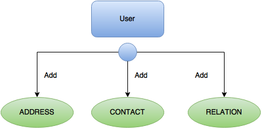
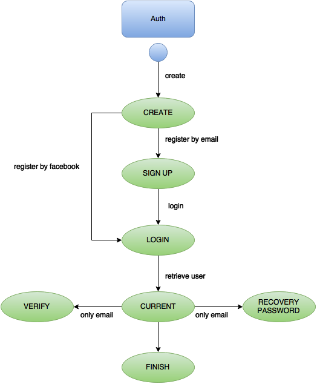
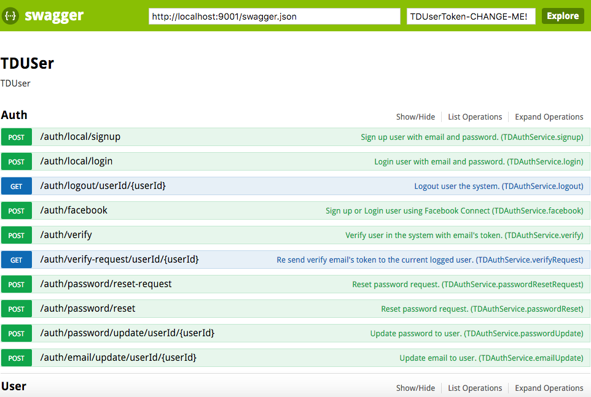

# TDUser

TDUser is a user register process API. Concretate on adding value to your apps, offer register, authentification email, recovery password email and integration with login facebook.


# Ok, but what can I do with it?

All application needs register users, here is where TDUser help you administrate this task.

TDUser handles all this commmon logic so that you do'nt have to worry about it:

- Registering users (address, contact info).
- Handling roles (user, admin).
- User authentication.
- Recovery password.
- Authentication with facebook.

TDUser  has a simple REST http API so that your app's backend can access it easily.

## Table of contents

  * [Dependencies](#dependencies)
  * [Setup](#setup)
    * [TDUser setup](#tduser-setup)
  * [How to get TDUser up and running](#how-to-get-tduser-up-and-running)
  * [Docker setup](#docker-setup)
  * [State diagrams TODO](#state-diagrams)
    * [User](#user)
    * [Auth](#auth)
  * [API Documentation](#api-documentation)
  * [Client libraries](#client-libraries)
  * [Contributing](#contributing)

## dependencies

TDUser is powered by great tech. Make sure these are present in your server box:

- [NodeJS](https://nodejs.org/en/) 4.2.2+
- [npm](https://www.npmjs.com/) 2.1.8+
- [MongoDB](https://www.mongodb.org/) 3.0+

## Setup

```sh
$ npm install
```

the above commands will, respectively:

- install TDUser's dependencies


### TDUser setup

> By default, on a development environment (NODE_ENV = development and PORT = 9001)


## How to get  TDUser up and running

*Inside TDUser's folder:*

Make sure your MongoDB is running.
To start TDUser's server with [grunt](http://gruntjs.com/)

```sh
$ grunt serve
```

or nodeJS

```sh
$ node server/app.js
```

### Running with [Docker]

There is a ready-to-go `Dockerfile` and a `docker-compose.yml` which makes it
easier to link the TDUser server with MongoDB container.

> **Note:** Using Docker will serve TDUser in development mode by default. You
can run it in production mode by setting up the `NODE_ENV` environment variable
in the `Dockerfile`. (Make sure you also setup corresponding production
environment variables such as mongo config at
`server/config/environment/production.js`)

To start TDUser with Docker, make sure you have installed [Docker] and
[Compose]. The best way to install them both is by installing the
[Docker Toolbox] if you're on OS X or Windows.

**IF YOU'RE NOT ON LINUX:** Make sure you have a virtual machine (VM) to use
Docker. You can create one with docker-machine:

```bash
# we'll call it dev, but you can call it whatever! :)
$ docker-machine create -d virtualbox dev
# Start the VM we just created
$ docker-machine start dev
# Set up the necessary env. variables for docker to be able to talk to the VM:
$ eval "$(docker-machine env dev)"
```

Then, inside TDUser folder, run:

```bash
$ docker-compose build
$ docker-compose up
```

to build the image and run the container. If you're on Linux, go to
`http://localhost:9001` *(if left in development mode)* where you'll see TDUser
running.

On Mac OS X or Windows, run:

```bash
$ docker-machine ip dev
```

take the output IP and replace `localhost` with it in the above URL.

[Docker]:https://www.docker.com/
[Compose]:https://docs.docker.com/compose/install/
[Docker Toolbox]:https://www.docker.com/docker-toolbox

## State diagrams

TDuser has mainly three (5) entities, **User**, **Relation**, **Address**, **Contact** and **Auth**. Here you have diagrams that shows the flow across
states they can take, but you should take a deeper look in the
[documentation](#api-documentation) section below.

#### User
</img>

#### Auth
</img>

## API Documentation

TDUser has also an [Swagger] API documentation. Start TDJobs, go to
[http://localhost:9001/swagger](http://localhost:9001/swagger) and play with it.

Once opened, the [Swagger] documentation should look like this:

</img>

## Client libraries

Although TDUser's REST interface makes it pretty straightforward to implement
from your client, a package is available to make it easy to manage User, Offers and
everything inside TDUser, from your NodeJS backend. You can take a look
[here](https://github.com/talosdigital/TDCore)!
You can also develop a new client library, and feature it here.

## Contributing

- Follow the steps in [CONTRIBUTING](CONTRIBUTING.md).